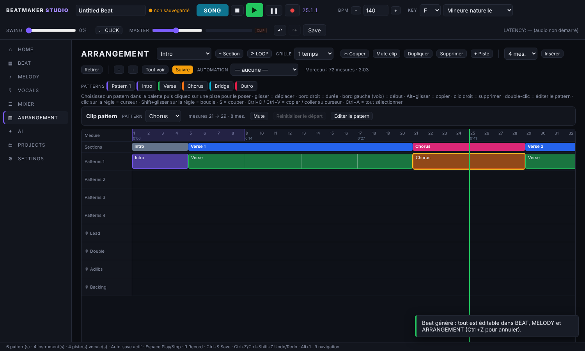
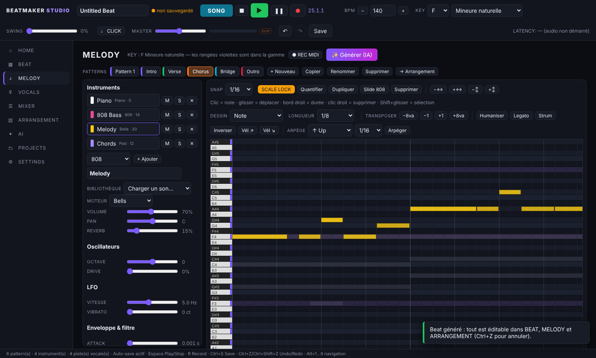
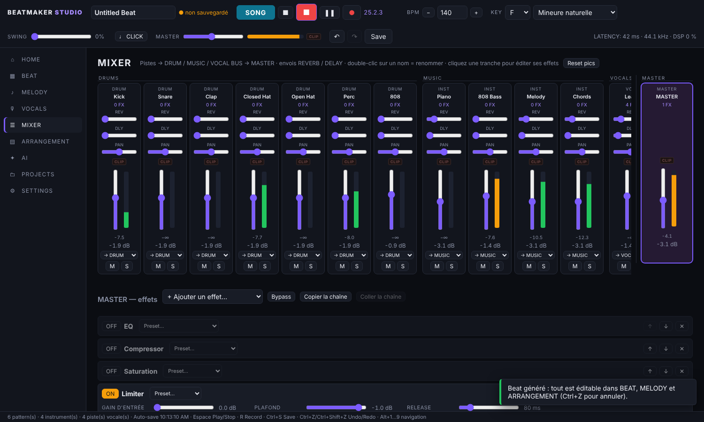
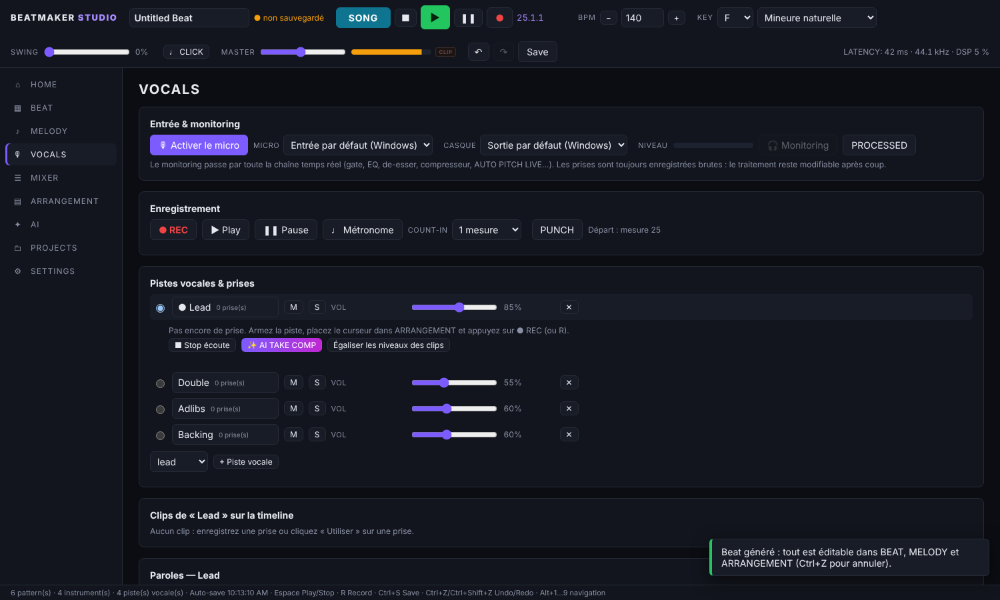
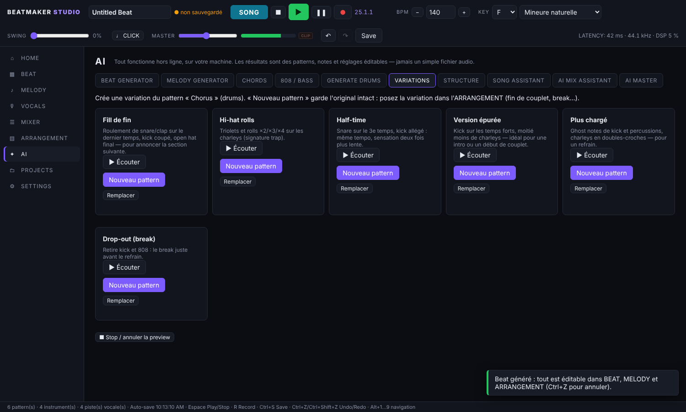

# Beatmaker Studio

Logiciel de production musicale pour le rap, la trap, la drill, l'afrobeat et le R&B. Il couvre tout le parcours : beat, mélodie, 808, arrangement, enregistrement de la voix, traitement vocal, mixage, IA, mastering et export. L'application est conçue pour **Windows** (Electron) et fonctionne aussi dans Chrome/Edge.



## Du beat au morceau fini

| Étape | Où | Ce qui se passe réellement |
|---|---|---|
| Projet, BPM, tonalité | Barre du haut | BPM 40–220, KEY + SCALE (12 gammes), swing, métronome |
| Drums | **BEAT** | Step sequencer : 7 pistes (Kick, Snare, Clap, Closed Hat, Open Hat, Perc, 808), 16/32/64 steps, vélocité, rolls ×2/×3/×4, mute/solo, volume/pan/pitch par piste, humaniser, quantifier, décaler / copier / coller / inverser une piste, plusieurs patterns, générateur de drums IA |
| Sons | **BEAT → SAMPLER** | Kit intégré synthétisé, import WAV/MP3/AIFF/OGG/FLAC, découpe, reverse, fondus, gain, pitch, boucle |
| Mélodies | **MELODY** | Piano roll (création, déplacement, durée, suppression, sélection multiple, copier/coller, dupliquer, quantifier, snap, zoom, vélocité), SCALE LOCK, dessin d'accords (triade, 7e, 9e, sus, power, octave), transposition par degré de gamme ou octave, humaniser, legato, strum, inverser, rampes de vélocité, arpégiateur (up/down/up-down/random) |
| Sons | **MELODY → Bibliothèque** | 9 moteurs (piano, e-piano, synth, pad, strings, pluck, bells, synth bass, 808) et 36 sons prêts (Dark Piano, R&B Rhodes, Mono Glide Lead, Choir Pad, Drill Strings, Kalimba, Reese Bass, 808 Distorted, 808 Drill…). Synthé : forme d'onde, unison 1–7 voix, octave, MONO/legato avec glide, drive, LFO vibrato et wobble du filtre, ADSR, filtre |
| 808 | **MELODY → 808** | 808 monophonique : pitch, glide/slide (touche L), punch, ADSR, saturation, distorsion, EQ, compression, calée sur le BPM |
| Arrangement | **ARRANGEMENT** | Timeline : sections (Intro, Verse, Pre-Chorus, Chorus, Bridge, Outro, personnalisées), clips déplaçables, redimensionnables, copiables (Alt), découpables au curseur (S), mutables, copier/coller au curseur, grille (mesure → 1/16), insérer / retirer des mesures (tout est décalé, y compris voix et automation), pistes renommables, inspecteur de clip (pattern, départ, gain, fades, normaliser), clips vocaux avec forme d'onde et fades, boucle, automation de volume et de pan, vue qui suit la lecture, règle en mesures et minutes |
| Voix | **VOCALS** | Micro USB ou interface, choix micro/casque, monitoring à travers la chaîne temps réel, REC/STOP/PAUSE/PLAY, métronome, count-in, punch in/out, prises multiples sur 4 pistes (Lead, Double, Adlibs, Backing) + pistes libres, compensation de latence, alerte saturation / niveau trop faible, liste des clips (gain, fades, mute, couper), paroles par piste enregistrées dans le projet |
| Chaîne vocale | **VOCALS** | Noise Reduction → Gate → EQ → De-Esser → Compressor → AUTO PITCH → AUTO LEVEL → Saturation → Limiter → Reverb/Delay. 7 presets de chaîne : Rap Lead, Melodic/Autotune, Hard Tune, Drill, Adlibs, Doubles/Backing, R&B Smooth (Alt+clic = écouter avant d'appliquer) |
| Correction | **AUTO PITCH** | LIVE (temps réel) et STUDIO (PSOLA, préserve les formants). Key/Scale, Correction, Retune Speed, Humanize, Formant. Presets Natural, Soft, Rap, Melodic, Modern, Hard Tune, Robot |
| Nettoyage | **AI VOICE CLEAN** | OFF/LOW/MEDIUM/HIGH, bascule RAW/PROCESSED |
| Cohérence | **VOICE CONSISTENCY / AUTO LEVEL** | Gain automatique, et niveau des clips aligné en LUFS |
| Analyse vocale | **✨ AUTO VOICE** | Analyse bruit, dynamique, spectre, sibilance, pitch et clipping, puis propose une chaîne : écouter, appliquer ou désactiver |
| Prises | **AI TAKE COMP** | Note chaque mesure de chaque prise. Vous acceptez ou changez chaque choix |
| Mix | **MIXER** | Tranches groupées (DRUMS / MUSIC / VOCALS / BUS & FX) et MASTER épinglé. Volume, pan, mute, solo, vu-mètres avec pic mémorisé et voyant CLIP, routage de chaque piste vers n'importe quel bus, renommage. Envois REVERB/DELAY. 13 effets (EQ, compresseur, limiteur, reverb, delay, saturation, distorsion, de-esser, gate, débruitage, AUTO PITCH, AUTO LEVEL, Stereo Width) avec presets, copier/coller de chaîne entre pistes |
| IA | **AI** | Générateur de beat à partir d'un texte, mélodies (4 options), CHORDS (progressions par humeur, tenus / stabs / arpège), 808 / BASS (calée sur le kick, slides), drums, VARIATIONS de pattern (fill, hi-hat rolls, half-time, épuré, chargé, drop-out), STRUCTURE (arrangement complet à partir de vos patterns, 5 modèles), assistant de composition, AI MIX ASSISTANT (PREVIEW puis APPLY), AI MASTER (mesure LUFS et true peak, ne clippe jamais) |
| Export | **PROJECTS** | WAV 16/24/32-bit float, MP3, 44.1 / 48 kHz. Variantes : Master, Instrumental, Vocals, Stems (.zip). Morceau complet ou région de boucle |
| Projet | **PROJECTS** | `.bsproj` (ZIP : JSON + audio), Ctrl+S, sauvegarde automatique, « Recover previous session? » |
| MIDI | Partout | Clavier vers l'instrument sélectionné, pads (canal 10) vers les drums, REC MIDI, MIDI LEARN, MIDI Out |

L'IA tourne **hors ligne, sur votre machine**. Elle produit des patterns, des notes et des réglages éditables, jamais un simple fichier audio. Un assistant en ligne (Claude) est disponible en option dans l'application desktop, avec votre clé API. Il ne reçoit qu'un **résumé texte** du projet, après confirmation, et **jamais d'audio**.

| | |
|---|---|
|  |  |
|  |  |

## Installation (Windows)

Prérequis : [Node.js 22 LTS](https://nodejs.org) (≥ 22.18).

```bash
npm install        # Electron, encodeur MP3 (lamejs), SDK Anthropic (assistant en ligne optionnel)
npm start          # lance l'application desktop
```

Autres commandes :

```bash
npm run dev        # version navigateur : http://127.0.0.1:5173 (Chrome ou Edge)
npm run dist:win   # installeur Windows (NSIS) + version portable dans release/
npm run test:all   # typecheck + tous les tests
```

Conseils audio : utilisez un **casque** pour le monitoring. Pour la latence la plus basse, branchez une interface audio, puis choisissez-la dans SETTINGS → Audio (entrée et sortie) avec « Latence minimale ».

## Raccourcis

Espace = Play/Stop · R = Record · Entrée = début · Ctrl+S = Save · Ctrl+O = Ouvrir · Ctrl+Z / Ctrl+Shift+Z = Undo/Redo · M / S = Mute/Solo · Alt+1…9 = pages.

Dans le piano roll : Suppr · Ctrl+C/V/D/A · ↑↓ (Shift = octave) · ←→ · L = slide 808.

Dans l'arrangement : S = couper au curseur · Ctrl+C / Ctrl+V = copier / coller au curseur · Ctrl+D = dupliquer · Ctrl+A = tout sélectionner · Suppr.

## Tests

| Commande | Contenu | Résultat |
|---|---|---|
| `npm run typecheck` | TypeScript strict sur tout `src/` | ✅ |
| `npm test` | 108 tests unitaires (Node) | ✅ 108/108 |
| `npm run test:browser` | 12 tests du moteur audio dans Chromium | ✅ 12/12 |
| `npm run test:e2e` | 26 étapes pilotant l'interface comme un utilisateur | ✅ 26/26 |

Détail des tests unitaires : DSP (YIN à ±5 cents, LUFS BS.1770 exact à ±0,05, true peak, compresseur, limiteur, gate, de-esser, leveler, pitch live et studio, débruitage), reducer, format de projet v1/v2, WAV, ZIP, générateurs et assistants IA, take comp, outils de notes (accords dans la gamme, arpégiateur, transposition…), découpe / insertion / suppression de mesures dans l'arrangement, routage du mixer, presets d'effets et de chaînes vocales, variations de drums, structures de morceau.

Détail des tests moteur : timing au sample près, swing, rolls, justesse de chaque instrument et des 36 sons de la bibliothèque, glide de la 808 et du synthé mono, Stereo Width, effets et routing (une piste suit le bus vers lequel elle est routée), mode song et clips vocaux, clip découpé qui rejoue la bonne partie du pattern, clip muté silencieux, fade-in de clip, marge des templates, temps réel.

Le test de bout en bout suit le scénario complet : nouveau projet → 140 BPM → F minor → drums → outils de piste → sampler → mélodie → 808 → arrangement IA → bibliothèque de sons, accords, arpège → découpe / mute / insertion de mesures → micro → monitoring traité → 2 prises → pitch LIVE et STUDIO (vérifié par mesure de pitch) → nettoyage (bruit −6 dB ou plus) → AUTO VOICE → take comp → presets de chaîne vocale et paroles → mixer (routage, presets, renommage) → assistant → AI MIX → CHORDS, 808, VARIATIONS, STRUCTURE → AI MASTER (true peak ≤ −1 dBTP) → export WAV, stems et région de boucle → sauvegarde → réouverture → crash recovery avec l'audio → MIDI.

Ce test utilise un micro factice de Chromium (une « voix » légèrement fausse) et un clavier MIDI simulé.

## Structure

```
src/core/            modèle, reducer (undo/redo), format .bsproj, musique — testés sous Node
src/core/dsp/        FFT, YIN, dynamique, loudness, autopitch, débruitage, analyse vocale, sampler
src/core/ai/         prompt, drums, mélodie/accords/basse, beat complet, assistant, mix, master, take comp
src/core/io/         WAV, ZIP
src/audio/           moteur Web Audio : mixer, effets, instruments, séquenceur, rendu offline,
                     enregistreur, worklets DSP, worker studio, export, MIDI
src/ui/              interface (shell, vues, widgets, persistance)
electron/            processus principal + preload (assistant en ligne, métriques, permissions)
tests/               unit/ · browser/ · e2e/
docs/ARCHITECTURE.md
```

## Limites connues

- **Desktop Electron non exécuté ici.** L'environnement de développement n'a pas accès à npm : `npm start` et `npm run dist:win` n'ont pas pu être lancés. Toute l'application a été testée dans Chromium, le même moteur qu'Electron. À vérifier en premier sur Windows.
- **Export MP3** : il utilise l'encodeur LAME du paquet `lamejs`, installé par `npm install`. Il n'a pas pu être testé ici. S'il est absent, l'option MP3 est désactivée avec un message ; le WAV fonctionne toujours.
- **Assistant en ligne** : passe par le SDK officiel Anthropic dans le processus principal d'Electron. Non testé ici (pas de réseau). L'assistant local, lui, est testé.
- **Latence** : Web Audio sous Windows passe par WASAPI en mode partagé, soit en général 10–40 ms en sortie. Le monitoring vocal reste confortable avec une interface audio, mais il n'y a pas d'ASIO : un moteur natif est prévu (voir l'architecture). AUTO PITCH LIVE ajoute environ 10 ms seulement quand il corrige.
- **CPU** : la charge DSP des effets est affichée partout. Le CPU des processus ne s'affiche que dans l'application desktop.
- **Time-stretch** des samples : non disponible. Le pitch change la durée, comme sur un sampler classique.
- **AI MASTER** : il mesure sur la partie la plus forte du morceau (autour du refrain). L'export affiche le loudness intégré du morceau complet.
- **Automation** : volume et pan (pas encore les paramètres d'effets).
